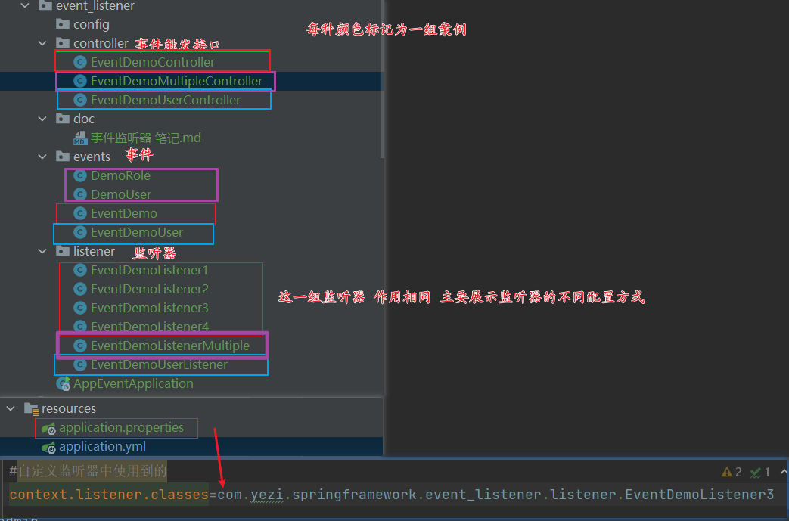

# 是什么？


# 为何使用？


# 


# 简单案例

Spring | 事件监听器应用与最佳实践-腾讯云开发者社区-腾讯云
https://cloud.tencent.com/developer/article/2332860


SpringBoot使用自定义事件监听器的demo_springboot 事件监听demo-CSDN博客
https://blog.csdn.net/myyhtw/article/details/131864725


在Spring的事件监听器模型中，主要涉及三个核心组件：事件（Event）、监听器（Listener）和事件发布器（Event Publisher）


代码结构



测试结果展示

## 第一组

```
@RestController
@RequestMapping(value = "/eventDemo")
public class EventDemoController {


    /**
     * 两种触发方式 ApplicationContext  、ApplicationEventPublisher
     */
     
    @Resource
    private ApplicationContext applicationContext;
    /**
     * http://localhost:8091/eventDemo/test1
     */
    @RequestMapping(value = "/test1")
    public String test1() {
        DemoUser demoUser = new DemoUser();
        demoUser.setUsername("root");
        demoUser.setPassword("123");
        EventDemo eventDemo = new EventDemo(demoUser);
        applicationContext.publishEvent(eventDemo);
        return "testEventDemo";
    }

    @Resource
    private ApplicationEventPublisher applicationEventPublisher;
    /**
     * http://localhost:8091/eventDemo/test2
     */
    @RequestMapping(value = "/test2")
    public String test2() {
        DemoUser demoUser = new DemoUser();
        demoUser.setUsername("root");
        demoUser.setPassword("123");
        EventDemo eventDemo = new EventDemo(demoUser);
        applicationContext.publishEvent(eventDemo);
        return "testEventDemo";
    }

}
```

接口1 

```
http://localhost:8091/eventDemo/test1
```

```java
自定义事件监听器（MyEventListener3）收到发布的消息: com.yezi.DemoUser@7ddc975c
自定义事件监听器（MyEventListener4）收到发布的消息: com.yezi.DemoUser@7ddc975c
自定义事件监听器（MyEventListener2）收到发布的消息: com.yezi.DemoUser@7ddc975c
自定义事件监听器（MyEventListener1）收到发布的消息: com.yezi.DemoUser@7ddc975c
```

接口2

```
http://localhost:8091/eventDemo/test2
```


```java
自定义事件监听器（MyEventListener3）收到发布的消息: com.yezi.DemoUser@2a3502e3
自定义事件监听器（MyEventListener4）收到发布的消息: com.yezi.DemoUser@2a3502e3
自定义事件监听器（MyEventListener2）收到发布的消息: com.yezi.DemoUser@2a3502e3
自定义事件监听器（MyEventListener1）收到发布的消息: com.yezi.DemoUser@2a3502e3
```


注意到，配置方式不同的监听器在触发监听的时候执行是有先后顺序的

## 第二组

```
/**
 * DemoUser 、 DemoRole 事件触发
 */
@RestController
@RequestMapping(value="/multipleDemo")
public class EventDemoMultipleController {
    /**
     * 两种触发方式 ApplicationContext  、ApplicationEventPublisher
     */

    @Resource
    private ApplicationContext applicationContext;

    /**
     * http://localhost:8091/multipleDemo/demoUser
     */
    @RequestMapping(value="/demoUser")
    public String demoUser() {
        DemoUser demoUser = new DemoUser();
        demoUser.setUsername("admin");
        demoUser.setPassword("123456");

        applicationContext.publishEvent(demoUser);
        return "testDemoUser";
    }

    @Resource
    private ApplicationEventPublisher applicationEventPublisher;
    /**
     * http://localhost:8091/multipleDemo/demoRole
     */
    @RequestMapping(value="/demoRole")
    public String demoRole() {
        DemoRole demoRole = new DemoRole();
        demoRole.setRoleId(4);
        demoRole.setRoleName("角色");
        applicationEventPublisher.publishEvent(demoRole);
        return "testDemoRole";
    }

}
```

接口1

```
http://localhost:8091/multipleDemo/demoUser
```


```java
listenerDemoUser---admin
```


接口2

```
http://localhost:8091/multipleDemo/demoRole
```


```java
listenerDemoUser---角色
```


## 第三组

```
/**
 * EventDemoUser 触发
 */
@RestController
@RequestMapping(value = "/eventDemoUser")
public class EventDemoUserController {
    /**
     * 两种触发方式 ApplicationContext  、ApplicationEventPublisher
     */

    @Resource
    private ApplicationContext applicationContext;

    @RequestMapping(value = "/test1")
    public String test1() {
        DemoUser demoUser = new DemoUser();
        demoUser.setUsername("admin");
        demoUser.setPassword("123456");

        applicationContext.publishEvent(new EventDemoUser(this, demoUser));
        return "testEventDemoUser";
    }

    @Resource
    private ApplicationEventPublisher applicationEventPublisher;

    @RequestMapping(value = "/test2")
    public String test2() {
        DemoUser demoUser = new DemoUser();
        demoUser.setUsername("admin2");
        demoUser.setPassword("654321");
        applicationEventPublisher.publishEvent(new EventDemoUser(this, demoUser));
        return "testEventDemoUser";
    }


}
```

接口1

```
http://localhost:8091/eventDemoUser/test1
```


```java
自定义事件监听器（EventDemoUserListener）收到发布的消息: admin
自定义事件监听器（EventDemoUserListener）收到发布的消息: 123456
```


接口2

```
http://localhost:8091/eventDemoUser/test2
```


```java
自定义事件监听器（EventDemoUserListener）收到发布的消息: admin2
自定义事件监听器（EventDemoUserListener）收到发布的消息: 654321
```


# 组件介绍


在Spring的事件监听器模型中，主要涉及三个核心组件：事件（Event）、监听器（Listener）和事件发布器（Event Publisher）


## 事件（Event）

事件通常是由某个特定的动作或者状态变化触发的。在Spring中，自定义事件通常需要继承`ApplicationEvent`类。事件类包含了事件的基本信息，例如事件源、发生时间等。

```java
import org.springframework.context.ApplicationEvent;

public class CustomEvent extends ApplicationEvent {
    public CustomEvent(Object source) {
        super(source);
    }
}
```


## 监听器（Listener）

监听器负责接收并处理事件。在Spring中，监听器通常是实现`ApplicationListener`接口的类，需要定义一个`onApplicationEvent`方法来具体处理事件。

```java
import org.springframework.context.ApplicationListener;
import org.springframework.stereotype.Component;

@Component
public class CustomEventListener implements ApplicationListener<CustomEvent> {
    @Override
    public void onApplicationEvent(CustomEvent event) {
        // 处理事件
        System.out.println("Received custom event - " + event);
    }
}
```


说明  上面案例中讲解了EventDemoListener类系列 涉及到不同的自定义监听器注入容器的方式 此处所讲的只是一种


## 事件发布器（Event Publisher）

事件发布器的角色是将事件通知到所有注册的监听器。在Spring应用中，`ApplicationEventPublisher`接口负责事件的发布


```java
import org.springframework.beans.factory.annotation.Autowired;
import org.springframework.context.ApplicationEventPublisher;
import org.springframework.stereotype.Component;

@Component
public class CustomEventPublisher {
    @Autowired
    private ApplicationEventPublisher applicationEventPublisher;

    public void doSomethingAndPublishAnEvent(final String message) {
        System.out.println("Publishing custom event.");
        CustomEvent customEvent = new CustomEvent(message);
        applicationEventPublisher.publishEvent(customEvent);
    }
}
```

补充 也可以使用ApplicationContext 的publishEvent 方法


# 源码解读

关于这部分 可以 结合spring bean 笔记中的启动类加载源码的理解 


org/springframework/context/support/AbstractApplicationContext.java publishEvent方法

```java
//event： 传入的对象
protected void publishEvent(Object event, @Nullable ResolvableType eventType) {
   Assert.notNull(event, "Event must not be null");

   // Decorate event as an ApplicationEvent if necessary
   // 获取到 传入的对象 的 ApplicationEvent 实现类 
   // 可能自身就是  如果不是 就根据传入的对象创建一个 ApplicationEvent 实现类 
   ApplicationEvent applicationEvent;
   // 传入的对象 如果实现ApplicationEvent接口
   if (event instanceof ApplicationEvent) {
      applicationEvent = (ApplicationEvent) event;
   }
   // 否则  根据传入的对象创建一个 ApplicationEvent 实现类 
   else {
      applicationEvent = new PayloadApplicationEvent<>(this, event);
       
      if (eventType == null) {
         eventType = ((PayloadApplicationEvent<?>) applicationEvent).getResolvableType();
      }
   }

   // Multicast right now if possible - or lazily once the multicaster is initialized
   // 
   if (this.earlyApplicationEvents != null) {
      this.earlyApplicationEvents.add(applicationEvent);
   }
   else {
      getApplicationEventMulticaster().multicastEvent(applicationEvent, eventType);
   }

   // Publish event via parent context as well...
   // 如果还有父类 那么父类也发布事件
   if (this.parent != null) {
      if (this.parent instanceof AbstractApplicationContext) {
         ((AbstractApplicationContext) this.parent).publishEvent(event, eventType);
      }
      else {
         this.parent.publishEvent(event);
      }
   }
}
```


# 工作流程

事件监听器模型的基本工作流程如下：

1. **事件源**产生事件。
2. **事件发布器**发布事件。
3. 注册的监听器接收到事件后进行处理。 这种模型支持了组件之间的低耦合交互，使得开发者可以更灵活、更方便地进行开发。


# 如何使用？

## 定义事件

在Spring中，我们可以通过继承`ApplicationEvent`类来定义自己的事件。这个类需要包含所有与事件相关的信息

```java
public class TestEvent extends ApplicationEvent {
    private String message;

    public TestEvent(Object source, String message) {
        super(source);
        this.message = message;
    }

    public String getMessage() {
        return message;
    }
}
```


补充 当然也可以不继承ApplicationEvent 在事件发布时 直接传入目标对象 但是这样的话 不够灵活  简单案例中的第二组就是直接传入的目标对象的方式


## 创建监听器

事件定义好后，我们需要创建监听器来处理这个事件。监听器是实现了`ApplicationListener`接口的类，需要覆写`onApplicationEvent`方法来定义事件的处理逻辑。

```java
@Component
public class TestEventListener implements ApplicationListener<TestEvent> {
    @Override
    public void onApplicationEvent(TestEvent testEvent) {
        // [3]在这里可以执行监听到事件后的逻辑, 监听到事件源，触发动作！
        System.out.println("监听到TestEvent：" + testEvent.getMessage());
    }
}
```

在这个例子中，我们定义了一个监听器`TestEventListener`，该监听器会打印出接收到的`TestEvent`事件中的`message`信息。


## 发布事件

最后，我们需要发布事件。事件的发布通常由事件发布器`ApplicationEventPublisher`来完成。

```java
@Component
public class TestEventPublisher {
    @Autowired
    private ApplicationEventPublisher applicationEventPublisher;

    public void publish(String message) {
        // [2]使用publishEvent方法发布事件，事件源为TestEvent
        applicationEventPublisher.publishEvent(new TestEvent(this, message));
    }
}
```

在这个例子中，`TestEventPublisher`类中的`publishEvent`方法会创建并发布一个新的`TestEvent`事件。

通过这三个步骤，我们就可以在Spring应用中实现事件的定义、监听和发布。这不仅有助于组件间的解耦，还能够增强代码的可维护性和可扩展性


说明 

发布事件 关键就是从容器中获取到事件发布器然后执行事件发布 

至于说哪里触发 看使用需要 比如说通过controller触发 


# 应用场景


# 参考资料

SpringBoot使用自定义事件监听器的demo_springboot 事件监听demo-CSDN博客
https://blog.csdn.net/myyhtw/article/details/131864725
